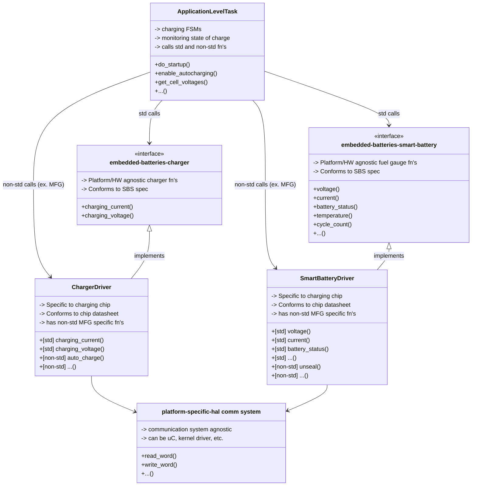
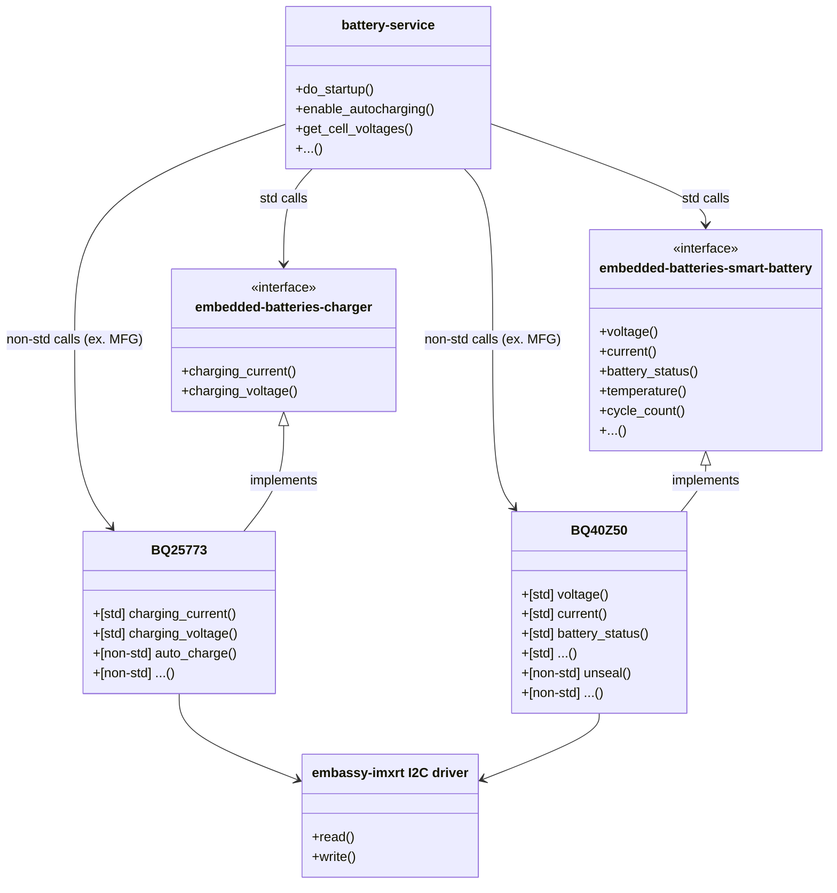

# embedded-batteries

A blocking Hardware Abstraction Layer (HAL) for battery fuel gauges and battery chargers used in embedded systems.

## Intro
This library is a set of traits designed to standardize interactions with battery systems in portable electronics. It follows the [Smart Battery System specification](https://sbs-forum.org/specs/sbdat110.pdf) to define generic functions that all battery chargers and all smart batteries (AKA fuel gauge, gas gauge) must implement to enforce a standard interface.

Additionally, the [ACPI Specification's Power Source and Power Meter Devices](https://uefi.org/htmlspecs/ACPI_Spec_6_4_html/10_Power_Source_and_Power_Meter_Devices/Power_Source_and_Power_Meter_Devices.html) battery control  messages are defined as an supplementary superset of the Smart Battery specification, for users building systems compliant with ACPI.

## Design Principles
### Generic Design Diagram

### Specific Example Design
- App level task: [battery-service](https://github.com/OpenDevicePartnership/embedded-services)
- Charger driver: [BQ25773](https://github.com/OpenDevicePartnership/bq25773)
- Smart Battery driver: [BQ40Z50](https://github.com/OpenDevicePartnership/bq40z50)
- Platform driver: [embassy-imxrt](https://github.com/OpenDevicePartnership/embassy-imxrt)

## Assumptions + Deviations from spec
As there is such a wide range of battery chargers and smart batteries, as well as different ways to electrically connect your smart battery system, a guiding principle of `embedded-batteries` is to make as little assumptions as possible. The SBS spec, which is the basis of the traits, is used as a *guide* rather than a *strict constraint*. Some common deviations and their solutions are listed below:

### Chargers and Fuel Gauges partially/not implementing the SBS spec
Charger and smart battery driver authors are given the flexibility on how their driver implements each SBS function. For example, if the smart battery does not have thermistors onboard, a Result with an "not implemented" error can be returned. Application level code must be able to handle the error accordingly.

### Smart Battery acting as a master
The SBS spec defines that the smart battery should be able to take control of the communication bus and broadcast alert messages. This functionality requires implementation of bus arbitration and as such, is not planned to be supported.

## Spec Coverage
### Charger

For detailed descriptions on how to use each function, please refer to the [Smart Battery System spec](https://sbs-forum.org/specs/sbdat110.pdf).

| Functions         | Code | Access | Data      | Implemented |
|-------------------|------|--------|-----------|-------------|
| charging_current   | 0x14 | w      | mA (u16)  |✅          |
| charging_voltage   | 0x15 | w      | mV (u16)  |✅          |

### Fuel Gauge

For detailed descriptions on how to use each function, please refer to the [Smart Battery System spec](https://sbs-forum.org/specs/sbdat110.pdf).

| Functions                | Code         | Access | Data                     | Implemented |
|--------------------------|--------------|--------|--------------------------|-------------|
| manufacturer_access*     | 0x00         | r/w    | word                     | -           |
| remaining_capacity_alarm | 0x01         | r/w    | mAh or 10mWh             | ✅          |
| remaining_time_alarm     | 0x02         | r/w    | minutes                  | ✅          |
| battery_mode             | 0x03         | r      | bit flags                | ✅          |
| at_rate                  | 0x04         | r/w    | mA or 10mW               | ✅          |
| at_rate_time_to_full     | 0x05         | r      | minutes                  | ✅          |
| at_rate_time_to_empty    | 0x06         | r      | minutes                  | ✅          |
| at_rate_ok               | 0x07         | r      | Boolean                  | ✅          |
| temperature              | 0x08         | r      | 0.1°K                    | ✅          |
| voltage                  | 0x09         | r      | mV                       | ✅          |
| current                  | 0x0a         | r      | mA                       | ✅          |
| average_current          | 0x0b         | r      | mA                       | ✅          |
| max_error                | 0x0c         | r      | percent                  | ✅          |
| relative_state_of_charge | 0x0d         | r      | percent                  | ✅          |
| absolute_state_of_charge | 0x0e         | r      | percent                  | ✅          |
| remaining_capacity       | 0x0f         | r      | mAh or 10mWh             | ✅          |
| full_charge_capacity     | 0x10         | r      | mAh or 10mWh             | ✅          |
| run_time_to_empty        | 0x11         | r      | minutes                  | ✅          |
| average_time_to_empty    | 0x12         | r      | minutes                  | ✅          |
| average_time_to_full     | 0x13         | r      | minutes                  | ✅          |
| charging_current         | 0x14         | r      | mA                       | ✅          |
| charging_voltage         | 0x15         | r      | mV                       | ✅          |
| battery_status           | 0x16         | r      | bit flags                | ✅          |
| cycle_count              | 0x17         | r      | count                    | ✅          |
| design_capacity          | 0x18         | r      | mAh or 10mWh             | ✅          |
| design_voltage           | 0x19         | r      | mV                       | ✅          |
| specification_info       | 0x1a         | r      | unsigned int             | ✅          |
| manufacture_date         | 0x1b         | r      | unsigned int             | ✅          |
| serial_number            | 0x1c         | r      | number                   | ✅          |
| reserved                 | 0x1d - 0x1f  |        |                          | -          |
| manufacturer_name        | 0x20         | r      | string                   | ✅          |
| device_name              | 0x21         | r      | string                   | ✅          |
| device_chemistry         | 0x22         | r      | string                   | ✅          |
| manufacturer_data*       | 0x23         | r      | data                     | -           |
| reserved                 | 0x25 - 0x2e  |        |                          | -           |
| optional_mfg_function_5* | 0x2f         | r/w    | data                     | -           |
| reserved                 | 0x30 - 0x3b  |        |                          | -           |
| optional_mfg_function_4* | 0x3c         | r/w    | word                     | -           |
| optional_mfg_function_3_1*| 0x3d - 0x3f | r/w    | word                     | -           |

*\* refers to optional fn's that will not be implemented*

### ACPI Battery Control Methods

For detailed descriptions on how to use each method, please refer to the [ACPI specification](https://uefi.org/htmlspecs/ACPI_Spec_6_4_html/10_Power_Source_and_Power_Meter_Devices/Power_Source_and_Power_Meter_Devices.html#battery-control-methods).

### Table 10.1 Battery Control Methods

| Object | Description | Implemented |
|--------|-------------|--------------|
| _BCT   | Returns battery estimated charging time. | ✅ |
| _BIF   | Returns static information about a battery (in other words, model number, serial number, design voltage, and so on). | ✅ |
| _BIX   | Returns extended static information about a battery (in other words, model number, serial number, design voltage, and so on). | ✅ |
| _BMA   | Sets the averaging interval of the battery capacity measurement, in milliseconds. | ✅ |
| _BMC   | Control calibration and charging. | ✅ |
| _BMD   | Returns battery information related to battery recalibration and charging control. | ✅ |
| _BMS   | Sets the sampling time of the battery capacity measurement, in milliseconds. | ✅ |
| _BPC   | Returns static variables that are associated with system power characteristics on the battery path and power threshold support settings. | ✅ |
| _BPS   | Returns the power delivery capabilities of the battery at the present time. | ✅ |
| _BPT   | Control method to set a Battery Power Threshold. | ✅ |
| _BST   | Returns the current battery status (in other words, dynamic information about the battery, such as whether the battery is currently charging or discharging, an estimate of the remaining battery capacity, and so on). | ✅ |
| _BTH   | Communicates battery thermal throttle limit set by battery thermal zone. | ❌ |
| _BTM   | Returns battery estimated runtime at the present average rate of drain, or the runtime at a specified rate. | ✅ |
| _BTP   | Sets the Battery Trip point, which generates an SCI when battery capacity reaches the specified point. | ✅ |
| _OSC   | OSPM Capabilities conveyance for batteries. | ❌ |
| _PSR   | Returns whether this power source device is currently online.| ✅ |
| _PIF   | Returns static information about a power source. | ✅ |
